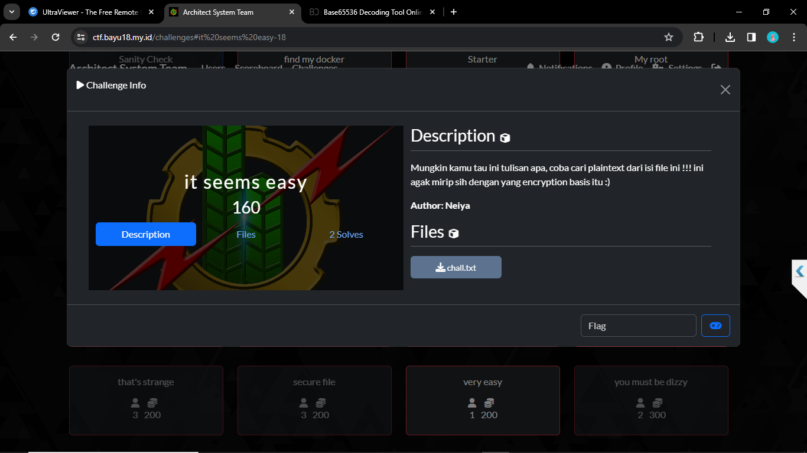
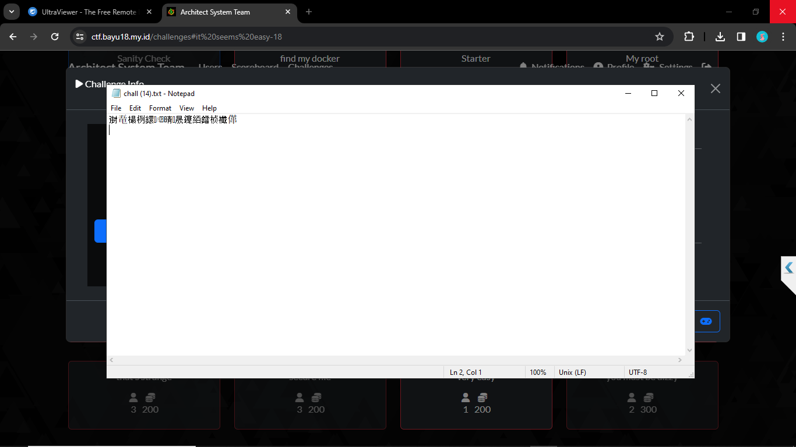
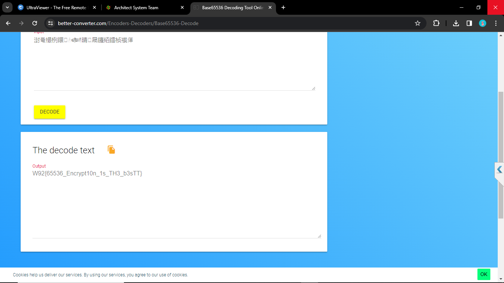

###     Attached
Mungkin kamu tau ini tulisan apa, coba cari plaintext dari isi file ini !!! ini agak mirip sih dengan yang encryption basis itu :)

 
Disini kita disuruh mencari metode enkripsi apa ini
### Solutions
Setelah saya buka,terdapat plaintext yang sudah di enkripsi.

setelah saya mencari di internet,ternyata ini adalah base 65536.

<https://github.com/qntm/base65536>

dan setelah saya decode,muncul

### FLAG:W92{65536_Encrypt10n_1s_TH3_b3sTT}